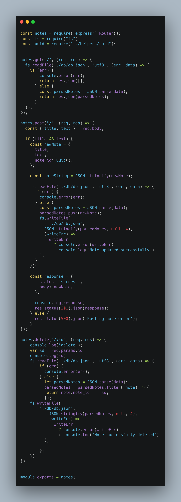

# Note-taker

## Technology Used 

|Technology | Resource |
|-----|:-----------|
| Git | [https://git-scm.com/](https://git-scm.com/)  
| JavaScript | [https://developer.mozilla.org/](https://developer.mozilla.org/en-US/docs/Web/JavaScript) |
| Node.js |[https://nodejs.org/docs/latest-v16.x/api/](https://nodejs.org/docs/latest-v16.x/api/) |
| Heroku | [https://devcenter.heroku.com/categories/reference](https://devcenter.heroku.com/categories/reference) |
| Express.js | [https://expressjs.com/en/guide/routing.html](https://expressjs.com/en/guide/routing.html) | 

## Description

Note taker, a note application created with Node.js and deployed by Heroku, allows "jotter downers" to enter, save, view, and delete notes on a user friendly interface. 
[Click here to view site deployed on Heroku](https://note-taker-hee.herokuapp.com/)

## Table of Contents
* [Code Snippet](#code-snippet)
* [Author Info](#author-info)
* [Credits](#credits)
* [License](#license)

## Learning Points
### POST Request
The block of server-side code below handles the HTTP POST request for creating a new note. If either 'title' or 'text' field are empty it sends an error status code 500 and JSON mesage "Posting note error". If 'title' and 'text' fields are populated, the code creates a new note object using JSON.stringify(). Using 'fs.readFile()' the code reads the content of 'db.json', and if successfull parses and appends a new note to the parsed array of notes. Using 'fs.writeFile()' the code writes an update array of notes back into 'db.json', and if successful logs a eureka message!

## Author Info

### Henner Espinoza

* [LinkedIn](https://www.linkedin.com/in/hennerespinoza)

* [GitHub](https://github.com/justhenner)

## Credits

* Study group members

## License

MIT License